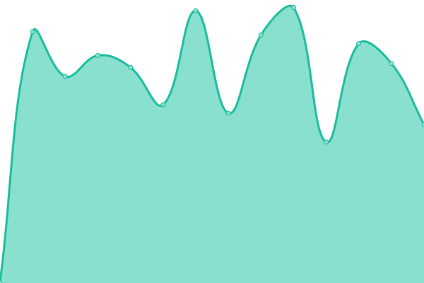
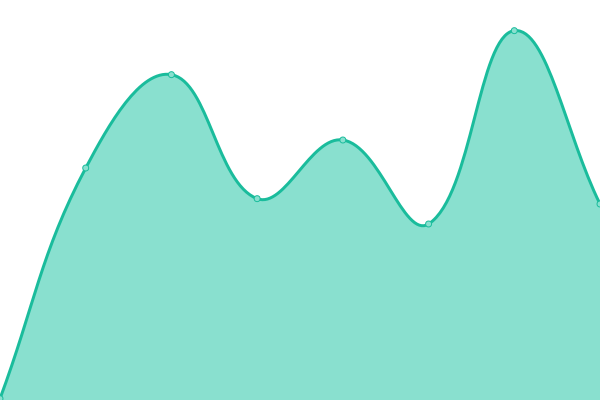

# [📈 Live Status](https://susupaa.github.io/susupaa-uptime): <!--live status--> **🟩 All systems operational**

This repository contains the open-source uptime monitor and status page for [Susupaa.com](https://susupaa.com), powered by [Upptime](https://github.com/upptime/upptime).

With [Upptime](https://upptime.js.org), you can get your own unlimited and free uptime monitor and status page, powered entirely by a GitHub repository. We use [Issues](https://github.com/susupaa/susupaa-uptime/issues) as incident reports, [Actions](https://github.com/susupaa/susupaa-uptime/actions) as uptime monitors, and [Pages](https://susupaa.github.io/susupaa-uptime) for the status page.

<!--start: status pages-->
<!-- This summary is generated by Upptime (https://github.com/upptime/upptime) -->
<!-- Do not edit this manually, your changes will be overwritten -->
<!-- prettier-ignore -->
| URL | Status | History | Response Time | Uptime |
| --- | ------ | ------- | ------------- | ------ |
|  [Susupaa API](https://api.susupaa.com/ready) | 🟩 Up | [susupaa-api.yml](https://github.com/susupaa/susupaa-uptime/commits/HEAD/history/susupaa-api.yml) | 

 350ms
     
 | 

<a href="https://status.susupaa.com/history/susupaa-api">100.00%</a>
    

|  [Collectors Dashboard](https://app.susupaa.com) | 🟩 Up | [collectors-dashboard.yml](https://github.com/susupaa/susupaa-uptime/commits/HEAD/history/collectors-dashboard.yml) | 

 164ms
     
 | 

<a href="https://status.susupaa.com/history/collectors-dashboard">100.00%</a>
    

|  [Checkout Portal](https://checkout.susupaa.com) | 🟩 Up | [checkout-portal.yml](https://github.com/susupaa/susupaa-uptime/commits/HEAD/history/checkout-portal.yml) | 

 169ms
     
 | 

<a href="https://status.susupaa.com/history/checkout-portal">100.00%</a>
    

|  [Pay Portal](https://pay.susupaa.com) | 🟩 Up | [pay-portal.yml](https://github.com/susupaa/susupaa-uptime/commits/HEAD/history/pay-portal.yml) | 

 167ms
     
 | 

<a href="https://status.susupaa.com/history/pay-portal">100.00%</a>
    

|  [Susupaa.com](https://www.susupaa.com) | 🟩 Up | [susupaa-com.yml](https://github.com/susupaa/susupaa-uptime/commits/HEAD/history/susupaa-com.yml) | 

 409ms
     
 | 

<a href="https://status.susupaa.com/history/susupaa-com">100.00%</a>
    

<!--end: status pages-->

[**Visit our status website →**](https://susupaa.github.io/susupaa-uptime)

## 📄 License

- Powered by: [Upptime](https://github.com/upptime/upptime)
- Code: [MIT](./LICENSE) © [Anand Chowdhary](https://anandchowdhary.com), supported by [Pabio](https://pabio.com)
- Data in the `./history` directory: [Open Database License](https://opendatacommons.org/licenses/odbl/1-0/)
